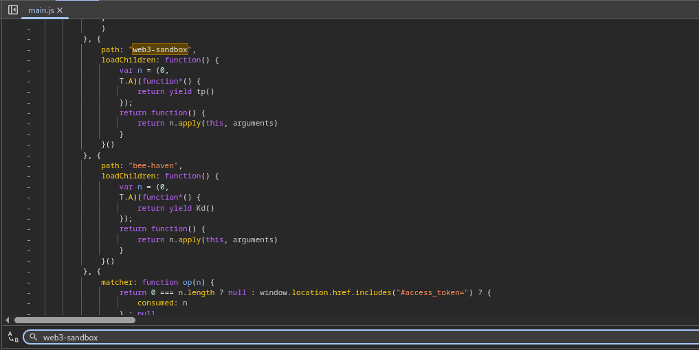
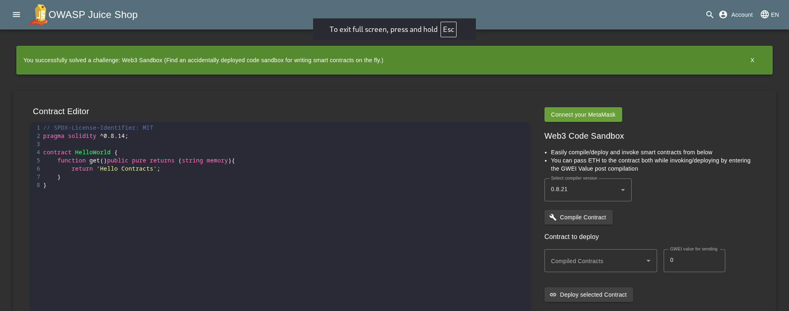

# Web3 Sandbox

## Objective

Find an accidentally deployed code sandbox for writing smart contracts on the fly.

## Solution

A Web3 sandbox is a testing environment designed for experimenting with Web3 technologies, such as blockchain, NFTs, and decentralized applications (dApps), in a controlled setting.

If you search for `web3-sandbox` in the `main.js` file, you can find that the application has a path for the sandbox environment.

Now visit `/#/web3-sandbox` to access the sandbox environment and solve the lab.

