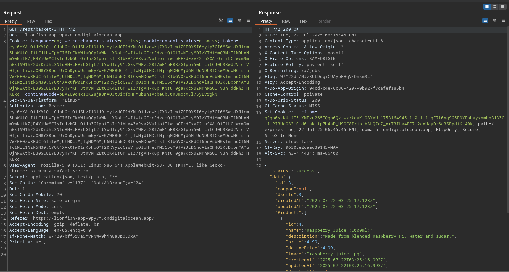
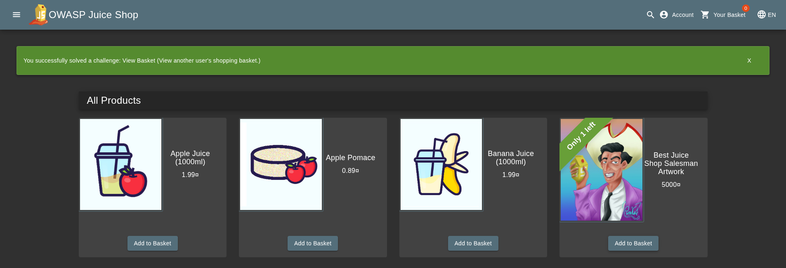

# View Basket

## Objective

View another user's shopping basket.

## Solution

First, inspect the requests sent to the server when you visit `/#/basket`.

You will notice a request to `GET /rest/basket/[basket-id]`. This endpoint returns the basket information in JSON format, including the basket ID and the associated user ID.

```json
{
  "status": "success",
  "data": {
    "id": 1,
    "coupon": null,
    "UserId": 1,
    "createdAt": "2026-08-11T11:44:00.066Z",
    "updatedAt": "2026-08-11T11:44:00.066Z",
    "Products": [
      {
        "id": 6,
        "name": "Banana Juice (1000ml)",
        "description": "Monkeys love it the most.",
        "price": 1.99,
        "deluxePrice": 1.99,
        "image": "banana_juice.jpg",
        "createdAt": "2026-08-11T11:43:59.841Z",
        "updatedAt": "2026-08-11T11:43:59.841Z",
        "deletedAt": null,
        "BasketItem": {
          "ProductId": 6,
          "BasketId": 1,
          "id": 9,
          "quantity": 2,
          "createdAt": "2026-08-11T14:49:12.331Z",
          "updatedAt": "2026-08-11T14:49:13.345Z"
        }
      }
    ]
  }
}
```

The `[basket-id]` parameter in `GET /rest/basket/[basket-id]` is a numerical identifier for the basket. The response also contains the corresponding `UserId`, indicating which user owns the basket.

To test for an authorization issue, change the `[basket-id]` value to the ID of **another valid basket ID** and resend the request. If the application does not verify that the requested basket belongs to the currently authenticated user, it will return another user's basket data.



The application returns another user's basket data without verifying that the authenticated user is authorized to access it. This demonstrates an insecure direct object reference (IDOR) vulnerability.


