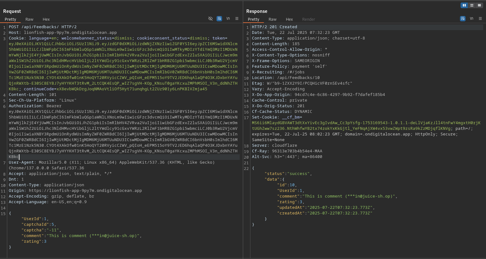
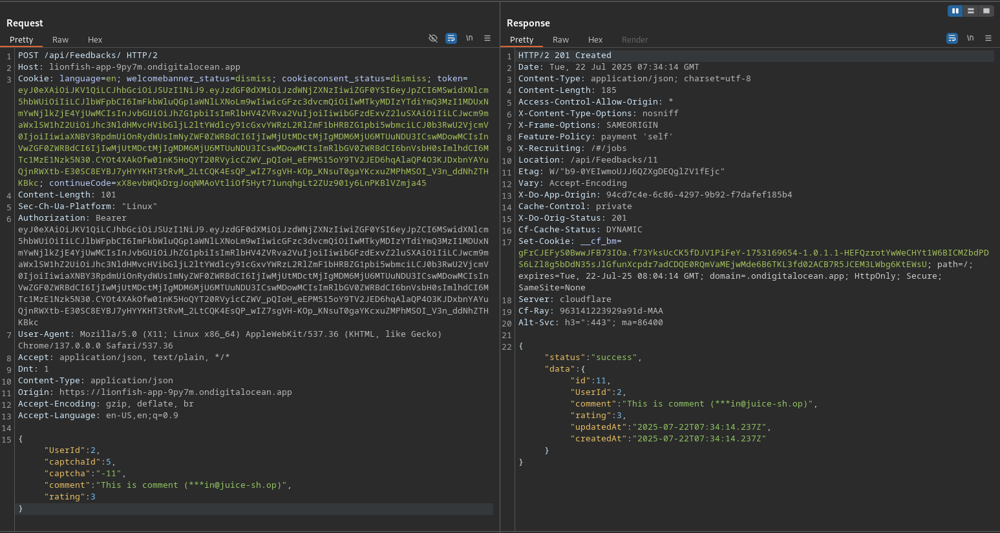
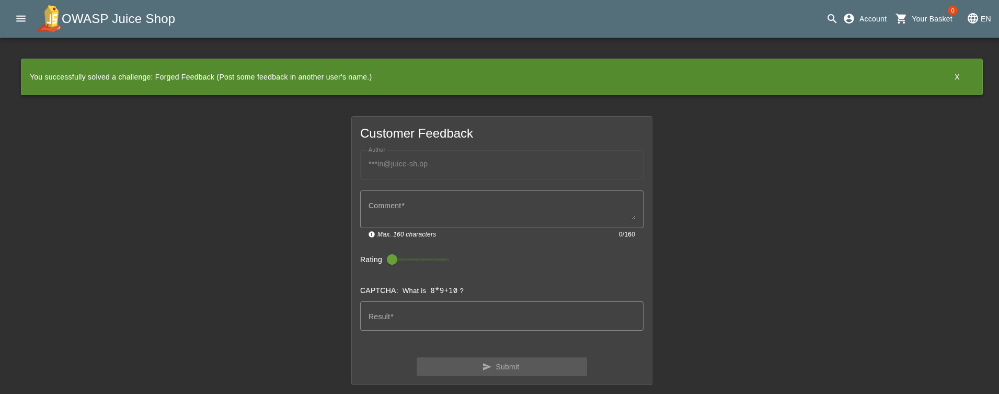

# Forged Feedback

## Objective

Post some feedback in another user's name.

## Solution

Post feedback and investigate what information is being sent to the server.



The application sends a request to `POST /api/Feedbacks/` with following data:

```json
{
    "UserId":1,
    "captchaId":0,
    "captcha":"180",
    "comment":"Testing feedback (***in@juice-sh.op)",
    "rating":2
}
```

Notice that the request contains a `UserId` parameter. This value identifies the user associated with the feedback and is supplied directly by the client.

To test whether the application properly verifies ownership of this value, change `UserId` to the ID of another user. Keep the other required parameters unchanged and resend the request. (e.g. changing `UserId` from `1` to `2`)

The server accepts the modified request and creates the feedback under the selected user's identity, the application is trusting the client-supplied UserId without properly verifying that it belongs to the authenticated user.



The feedback has now been created in another user's name, demonstrating that the application's authorization checks can be bypassed by modifying the `UserId` parameter.


