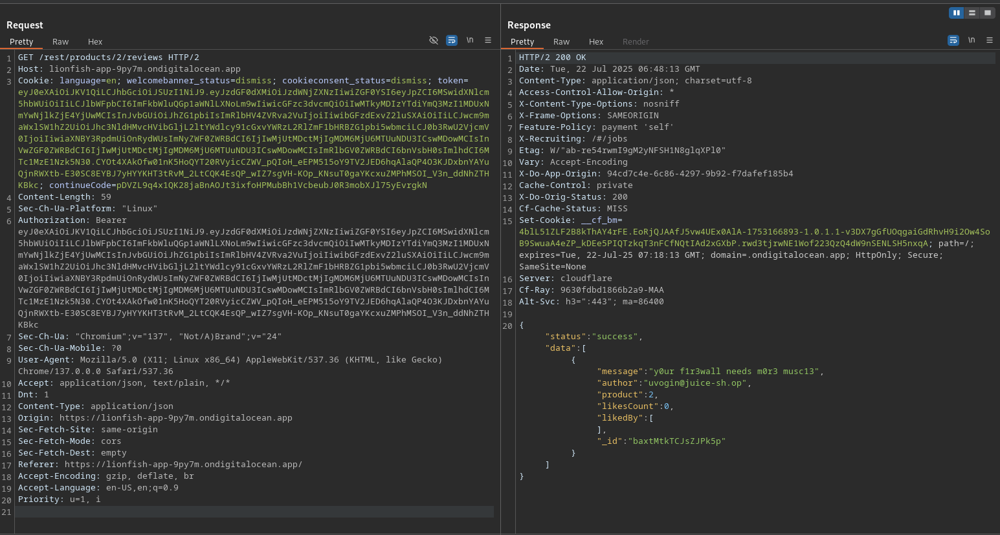
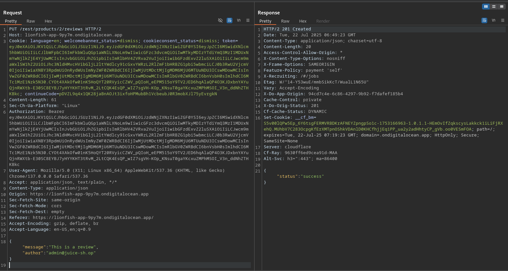
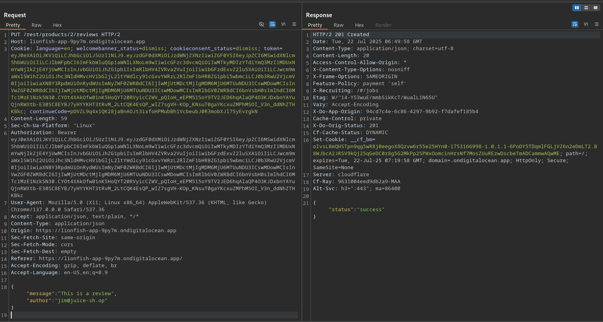
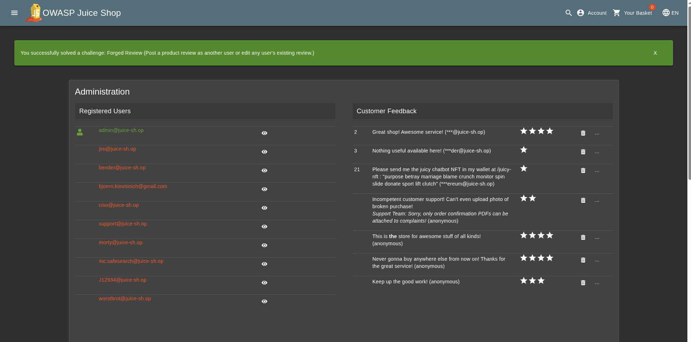

# Forged Review

## Objective

Post a product review as another user or edit any user's existing review.

## Solution

First, add a product to your basket and submit a review for that product. Then, inspect the request sent to the server to determine how the review is submitted and which parameters control the reviewer's identity.

The application retrieves the reviews for a product using `GET /rest/product/2/reviews`, where `2` represents the product ID.



When you submit a review for the product, the application sends a **PUT** request containing two important fields: `message`, which contains the review text, and `author`, which identifies the user who submitted the review.

```json
{"message":"This is a review","author":"admin@juice-sh.op"}
```



The `author` field is supplied by the client, so we can test whether the application properly verifies that the authenticated user matches the specified author.

Change the author email address to that of another registered user and resend the request. You can find the email addresses of registered users in the [admin section](./02_Admin-section.md).



The application accepts the modified request and displays the review as being written by the selected user, the review can be forged because the server does not properly validate the author of the review.


