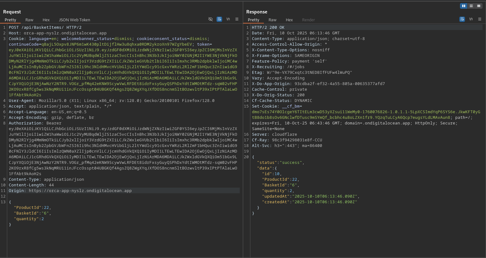
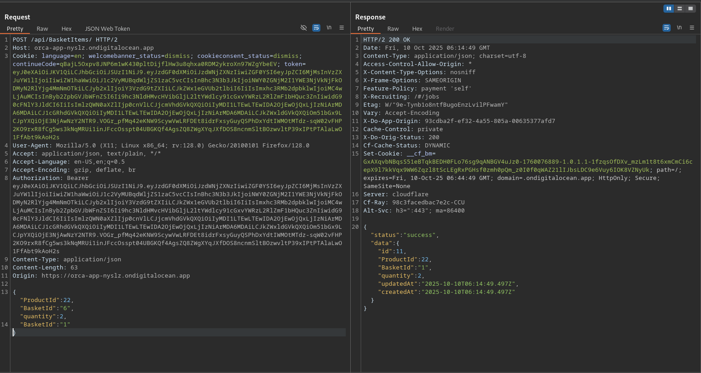
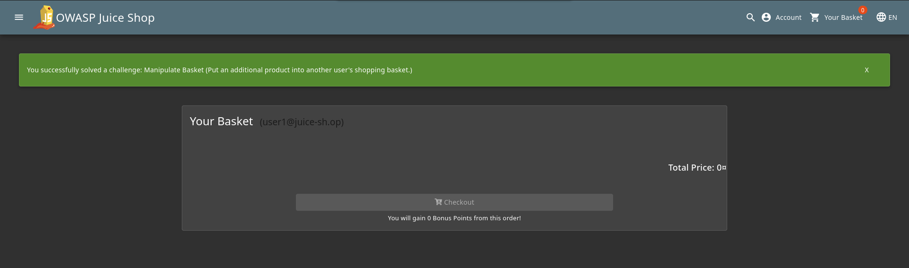

# Manipulate Basket

## Objective

Put an additional product into another user's shopping basket.

## Solution

First, click the "Add to basket" button for any product and inspect the request sent to the server. The application sends a **`POST`** request to `/api/BasketItems/` with the following JSON data:

```json
{"ProductId":25,"BasketId":"6","quantity":1}
```



The request contains a `BasketId` parameter that determines which shopping basket receives the product. Because this value is supplied by the client, we can test whether the application properly validates that the basket belongs to the authenticated user.

By using duplicate `BasketId` parameters, we can perform parameter pollution and attempt to make the server process a different basket ID. In this case, the goal is to add the selected product to another user's shopping basket.

Send the request with the following data. The duplicate `BasketId` parameter changes the basket that receives the product from `6` to `1`.

```json
{
  "ProductId":25,
  "BasketId":"6",
  "quantity":1,
  "BasketId":"1"
}
```



The application accepts the modified request with duplicate `BasketId` parameters and we can influence which basket receives the product and add an item to another user's shopping basket.


