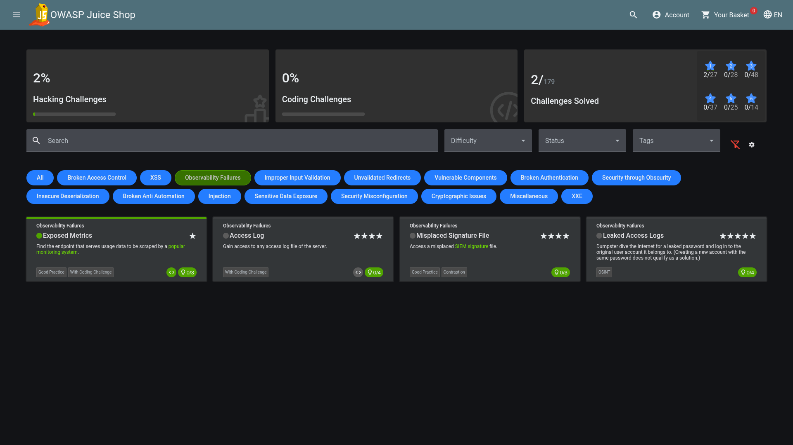

# Observability Failures

Observability Failures (often categorized alongside insufficient logging and monitoring) occur when an application or system fails to adequately capture, retain, or monitor its internal runtime states, logs, and metrics.

