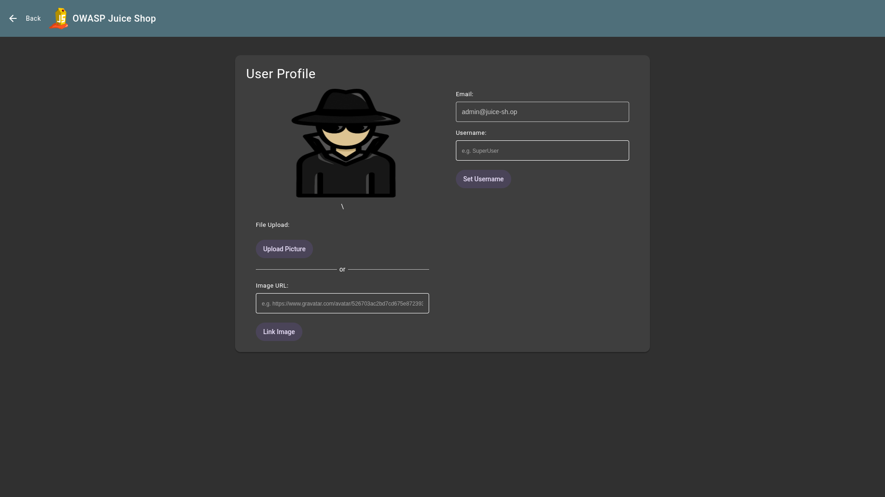

# Password Strength

## Objective

Log in with the administrator's user credentials without previously changing them or applying SQL Injection.

## Solution

The administrator's default email address in OWASP Juice Shop is `admin@juice-sh.op` which you can find by browsing the application.

The challenge requires you to find the administrator's original, weak password. This password is famously simple and can be easily guessed or found via common password lists: `admin123`.

Now navigate to login page (`/#/login`) and enter the following credentials to access **administrator** user profile page.

```text
email: admin@juice-sh.op
password: admin123
```


