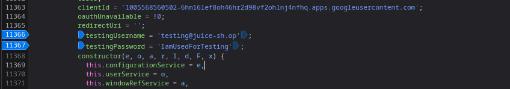
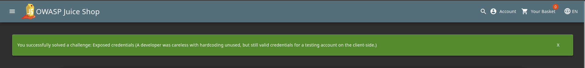

# Exposed credentials

## Objective

A developer was careless with hardcoding unused, but still valid credentials for a testing account on the client-side.

## Solution

After inspecting all the JavaScript files from the source, a **username** and **password** were found hardcoded in the `main.js` file on lines `11366` and `11367`.

```js
testingUsername = 'testing@juice-sh.op';
testingPassword = 'IamUsedForTesting';
```




