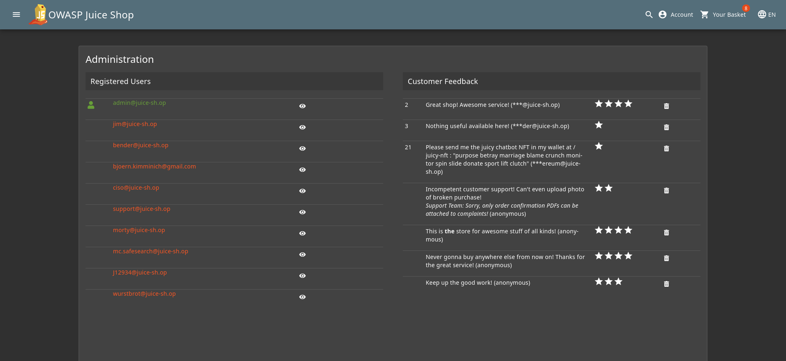
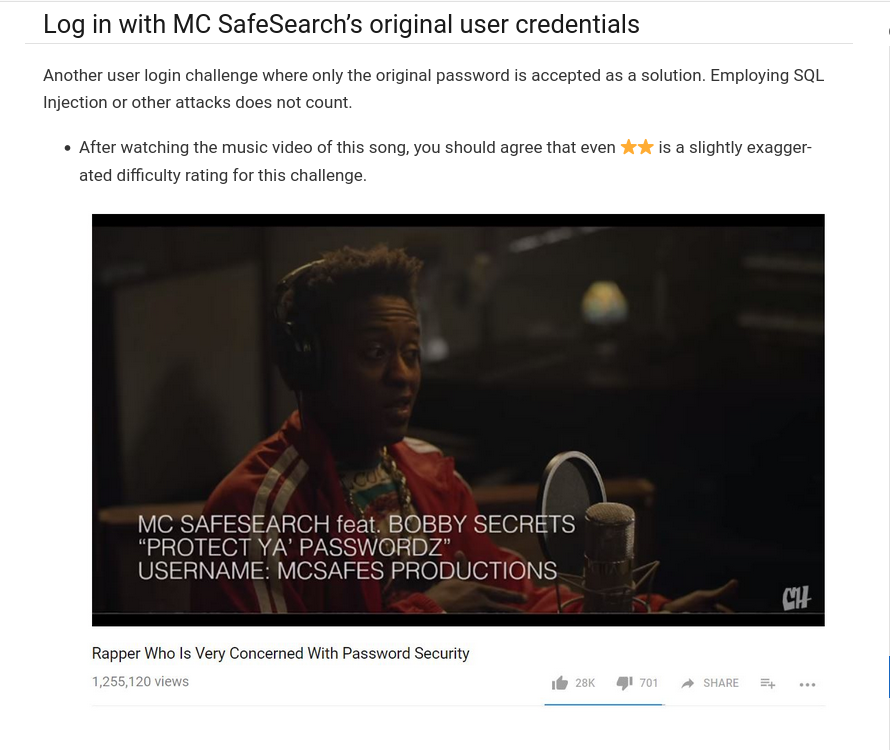
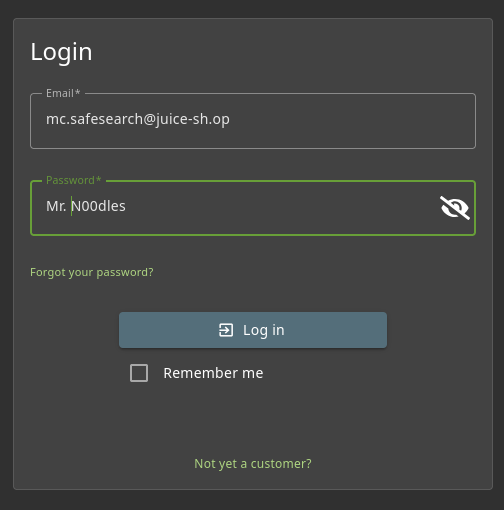
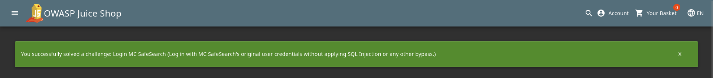

# Login MC SafeSearch

## Objective

Log in with MC SafeSearch's original user credentials without applying SQL Injection or any other bypass.

## Solution

Log in as admin with the following credentials.

```text
email: admin@juice-sh.op
password: admin123
```

In the administration section (`/#/administration`), you will find an email associated with Mc Safesearch (`mc.safesearch@juice-sh.op`).



The hint page of this challenge asks you to listen to a music video of a song **"Rapper Who Is Very Concerned With Password Security"**.



If you read the lyrics of that song [(https://genius.com/Collegehumor-protect-ya-passwordz-lyrics)](https://genius.com/Collegehumor-protect-ya-passwordz-lyrics), you will find a line that says.

*`Mine's my dog, Mr. Noodles. It doesn't matter if you know`*
*`'Cause I was tricky and replaced some vowels with zeroes`*

**From this, you can deduce that the password may be `Mr. N00dles`.**

Now logout from **admin** account and login with the following credential to solve the lab:

```text
email: mc.safesearch@juice-sh.op
password: Mr. N00dles
```




