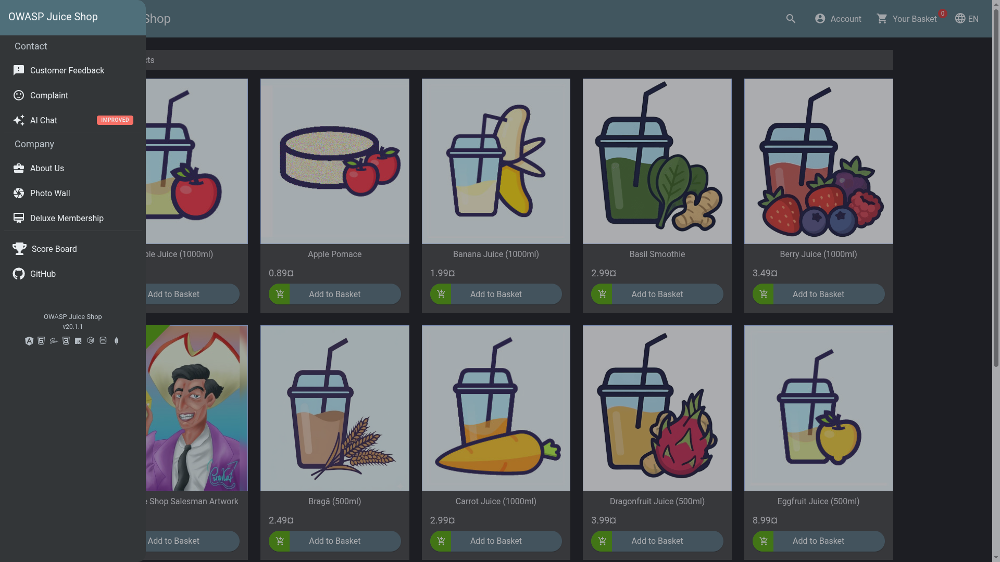
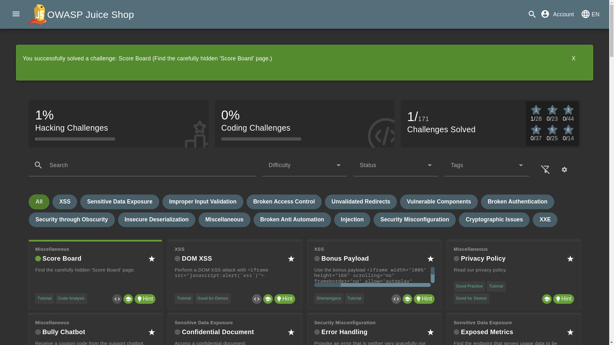

# Score Board

## Objective

Find the carefully hidden 'Score Board' page.

## Solution

The Score Board is accessible from the application's normal navigation, but it is not immediately visible until the sidebar menu is opened.

- First, open the application's sidebar by clicking the menu icon in the navigation bar.
- Look through the available navigation options and locate Score Board. Click it to open the Score Board page.

OR you can simply visit `/#/score-board`

The Score Board displays the list of available Juice Shop challenges along with their current completion status.

