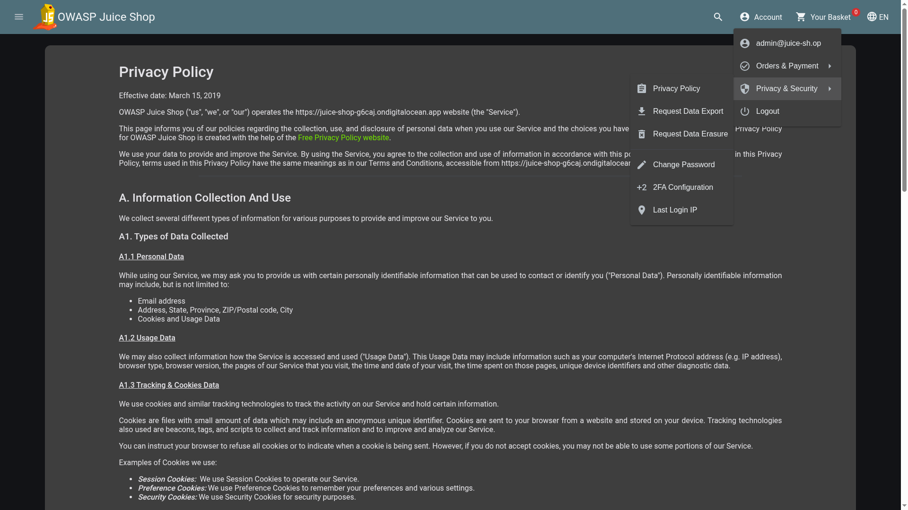

# Privacy Policy

## Objective

Read our privacy policy.

## Solution

- First, log in to the application with any user account.
- Next, click the profile picture in the top-right corner of the application to open the profile dropdown menu.
- From the dropdown menu, select Privacy & Security.
- The application will open the Privacy & Security section. From there, select Privacy Policy.

The Privacy Policy page is loaded at: `/#/privacy-security/privacy-policy`

Simply visiting this page triggers the challenge and marks Read our privacy policy as solved.
