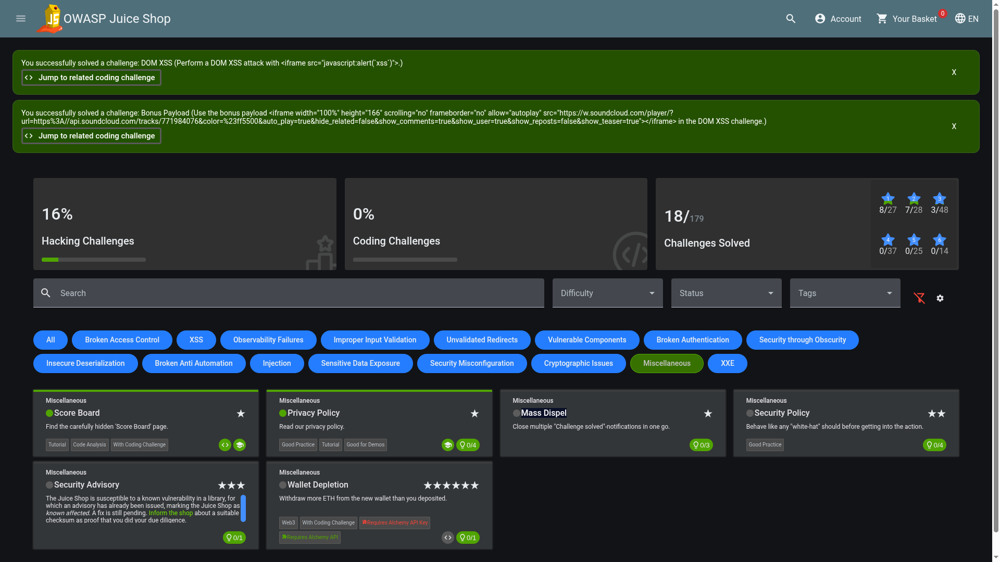

# Mass Dispel

## Objective

Close multiple "Challenge solved" notifications in one go.

## Solution

Whenever a challenge is successfully completed, OWASP Juice Shop displays a **"Challenge solved!"** notification. These notifications do not disappear automatically, so several of them can accumulate on the screen.

First, make sure that multiple "Challenge solved!" notifications are visible. You can do this by solving several challenges. If your Juice Shop instance has restored your previous challenge progress after a restart, several success notifications may also appear automatically when you open the application.

**Instead of closing each notification individually, hold down the Shift key and click the X button on any one of the notifications.**

_Holding Shift while clicking the close button dismisses all currently displayed challenge notifications at once._

The Mass Dispel challenge is now completed.
