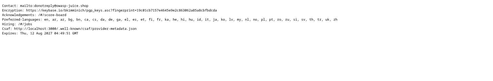

# Mass Dispel

## Objective

Behave like any "white-hat" should before getting into the action.

## Solution

Before testing an application for security vulnerabilities, a responsible security researcher should first check whether the application publishes a security policy that explains how vulnerabilities should be reported.

OWASP Juice Shop follows the `security.txt` standard for publishing this information. The challenge can be solved by locating the application's `security.txt` file.

Request the following URL from your Juice Shop instance:

```http
http://<juice-shop-host>/.well-known/security.txt
```

The server returns the application's security policy, including information about how security vulnerabilities should be reported.


